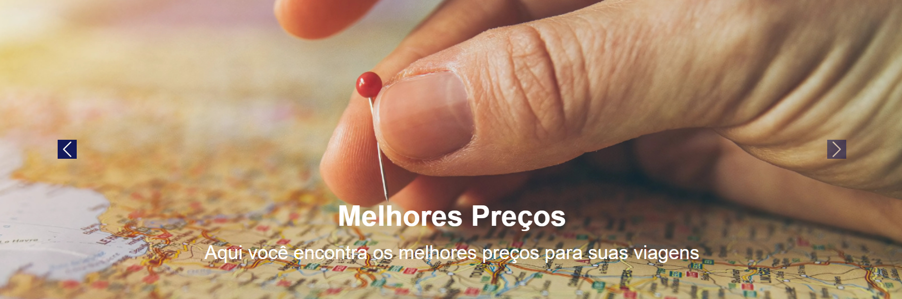
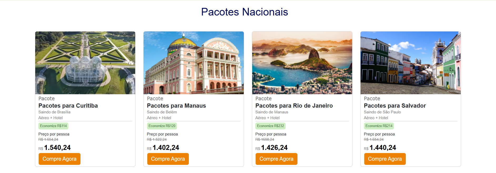
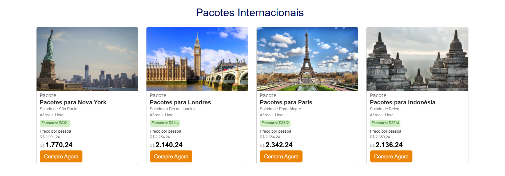
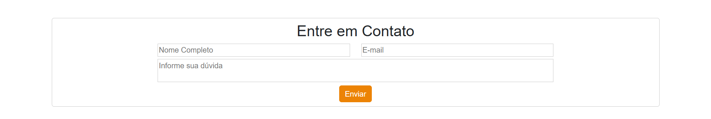
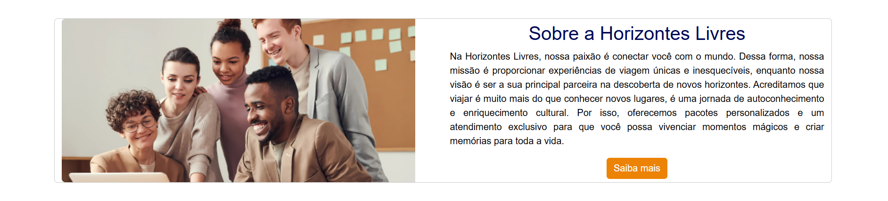
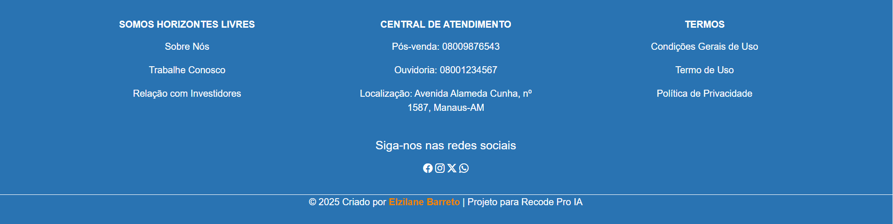
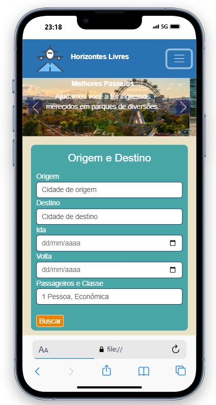
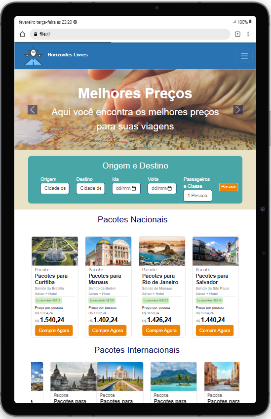

# Agência Horizontes Livres 
 Trata-se de um projeto inovador focado na criação de uma agência de viagens, oferecendo uma interface agradável e intuitiva para os usuários explorarem e planejarem suas aventuras. 

## Índice
1. [Sobre](#sobre)
2. [Funcionalidades](#funcionalidades)
3. [Tecnologias Utilizadas](#tecnologias-utilizadas)
   - Front-end
4. [Pré-requesitos](#pré-requesitos)
5. [Instalação](#instalação)

## Sobre
A agência de viagens Horizontes Livres é um site cujo objetivo é proporcionar uma experiência excepcional para o usuário, permitindo que os clientes encontrem e reservem seus pacotes de viagem de maneira fácil e eficiente. Desde a página inicial, os clientes podem pesquisar pacotes de viagem com destinos específicos e fazer login em suas respectivas contas.

O site oferece a opção de personalizar as viagens, permitindo que os clientes insiram o local de origem, destino, datas de início e término da viagem e a quantidade de pessoas inclusas no pacote. Além disso, a agência oferece pacotes nacionais e internacionais em promoção, acessíveis com um clique no botão específico.

Adicionalmente, há uma área dedicada para que os clientes possam esclarecer suas dúvidas sobre pacotes específicos ou personalizados. Por fim, o site exibe a missão e os objetivos da agência, destacando como pretendemos proporcionar aos usuários as melhores oportunidades de viagem.

## Funcionalidades

- Colocar o destino específico e fazer login.
  


- Slides com anúncios para chamar a atenção com a opção do usuário passar para a próxima imagem ou a anterior.
 


- Seção para inserir a viagem específica.
  


- Pacotes nacionais com promoção.
  


- Pacotes com promoções internacionais.
  


- Seção para o cliente entrar em contato e esclarecer suas dúvidas.


- Apresentação da missão e visão da agência.
  


- Rodapé com os termos de privacidades, redes sociais, central de atendimento e junte-se a agência.
  


- O site é responsivo, isto é, se adapta em qualquer tamanho de tela, como:

  Em iPhone 13 Pro
  


  Galaxy Tab S7</p>
  

    
  
## Tecnologias Utilizadas

Algumas ferramentas foram usada para o desenvolvimento do projeto.

### Front-end


-   Html5: para a estrutura do site;

-   Css3: para a estilização;

-   Bootstrap: para a responsivadade e layout prontos.

## Pré-requesitos
Para a excução do projeto localmente, precisa de:

- Um navegador compatível com HTML5 e CSS3.
    
    Ex.: Microsoft Edge, Google Chrome, FireFox e outros.
 
- Um editor de código.

    Ex.: VsCode (Visual Studio Code)

- Git instalado.


## Instalação

```bash
# Copie o link do repositório remoto do GitHub que está no <code>.

# Entre no cmd ou PowerShell do computador.

# Entre no diretório em que deseja salvar a pasta. Use o comando: cd. Ex.:
cd Desktop 

# Faça o clone do repositório no GitHub com o link
git clone https://github.com/elzilanebarreto/Agencia-de-viagens.git

# Entre no diretório do projeto
cd Agencia-de-viagens

# Acesse o editor de código. Ex.: o VSCode
code .

# Com o comando anterior, o VSCode irá abrir direto na pasta do projeto.

```
