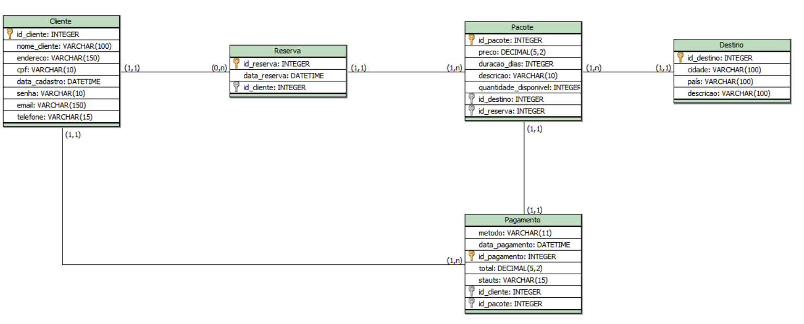

# Agência Horizontes Livres 
 Trata-se de um projeto inovador focado na criação de uma agência de viagens, oferecendo uma interface agradável e intuitiva para os usuários explorarem e planejarem suas aventuras. 

## Índice
1. [Sobre](#sobre)
2. [Funcionalidades](#funcionalidades)
3. [Tecnologias Utilizadas](#tecnologias-utilizadas)
   - [Front-end](#front-end)
   - [Back-end](#back-end)
4. [Pré-requisitos](#pré-requisitos)
5. [Instalação](#instalação)
6. [Modelagem do Banco de Dados](#modelagem-do-banco-de-dados)
   - [Modelo Conceitual](#modelo-conceitual)
   - [Modelo Lógico](#modelo-lógico)
   - [Modelo Físico](#modelo-físico)
7. [Configuração das Pastas](#configuração-das-pastas)

## Sobre
A agência de viagens Horizontes Livres é um site cujo objetivo é proporcionar uma experiência excepcional para o usuário, permitindo que os clientes encontrem e reservem seus pacotes de viagem de maneira fácil e eficiente. Desde a página inicial, os clientes podem pesquisar pacotes de viagem com destinos específicos e fazer login em suas respectivas contas.

O site oferece a opção de personalizar as viagens, permitindo que os clientes insiram o local de origem, destino, datas de início e término da viagem e a quantidade de pessoas inclusas no pacote. Além disso, a agência oferece pacotes nacionais e internacionais em promoção, acessíveis com um clique no botão específico.

Adicionalmente, há uma área dedicada para que os clientes possam esclarecer suas dúvidas sobre pacotes específicos ou personalizados. Por fim, o site exibe a missão e os objetivos da agência, destacando como pretendemos proporcionar aos usuários as melhores oportunidades de viagem.

## Funcionalidades

- Barra de menu:

  - Logo e nome da agência, com link para a página principal;
  - Opções de páginas que farão parte do site;
  - Procurar por um destino específico, sem estar logado;
  - Ícone de login, onde o cliente entrar com seu e-mail e senha, ou criará uma conta para realizar sua compra.
  


- Slides com anúncios para chamar a atenção.
   - O usuário terá a opção de passar para o próximo slides de forma manual, usuando as setas;
   - O usuário espera 4 segundo para o slide passar sozinho;
   - O slides para, na imagem específica, se o usuário deixar o cursor em cima da imagem.
 


- Seção para inserir a viagem específica.
  
   - O cliente irá preencher os dados correspondentes de cada campo;
   - Quando o cliente apertar o botão de `buscar`, será direcionado para os pacotes correspondentes.
  


- Pacotes nacionais com promoção.
  
   - O usuário poderá escolher um pacote específico;
   - Selecionará o botão de compra:
      - Se o usuário já estiver logado, será direcionado para a opção de pagamento;
      - Se não estiver logado, será direcionado para fazer o login ou cadastrar uma conta.
  


- Pacotes com promoções internacionais.

  - O usuário poderá escolher um pacote específico;
  - Selecionará o botão de compra:
     - Se o usuário já estiver logado, será direcionado para a opção de pagamento;
     - Se não estiver logado, será direcionado para fazer o login ou cadastrar uma conta.
   - Os cards com os pacotes passará automaticamente, para o cliente ter mais opção de escolha.
  


- Seção para o cliente entrar em contato e esclarecer suas dúvidas.

  - Logo após enviar a dúvida e os dados necessários para os campos, a agência entrará em contato com o cliente através do e-mail disponibilizado. 
  


- Apresentação da missão e visão da agência.

  - O botão `saiba mais`, o usuário será direcionado para a página do `sobre nós`, presente no menu.
  


- Rodapé com os termos de privacidades, redes sociais, central de atendimento e junte-se a agência.
  


- O site é responsivo, isto é, se adapta em qualquer tamanho de tela, como:

  Em iPhone 13 Pro
  


  Galaxy Tab S7</p>
  

    
  
## Tecnologias Utilizadas

Algumas ferramentas foram usada para o desenvolvimento do projeto.

### Front-end


-   HTML5: para estrutura do site;

-   CSS3: para a estilização;

-   Bootstrap: framework que oferece componentes prontos e responsivos;

- Media Queries: adapta o layout do site para diferentes tamanhos de tela.

### Back-end

- BrModelo: para a modelagem do banco.

## Pré-requisitos
- Para acesso ao site:
  
  - Link do versel: [Agência Horizontes Livres](https://agencia-de-viagens-ruddy.vercel.app/)
  - Link do git pages: [Agência Horizontes Livres](https://elzilanebarreto.github.io/Agencia-de-viagens/)
  - Precisa de um computador ou tablet ou smartphone, com internet.


- Para a execução do projeto localmente, precisa de:

  - Um navegador compatível com HTML5 e CSS3.
      
      Ex.: Microsoft Edge, Google Chrome, FireFox e outros.
  
  - Um editor de código.

      Ex.: VsCode (Visual Studio Code)

  - Git instalado.


## Instalação

Siga os passos abaixo para configurar o projeto localmente:

```bash
# Copie o link do repositório remoto do GitHub que está no <code>.

# Entre no cmd ou PowerShell do computador.

# Entre no diretório em que deseja salvar a pasta. Use o comando: cd. Ex.:
cd Desktop 

# Faça o clone do repositório no GitHub com o link
git clone https://github.com/elzilanebarreto/Agencia-de-viagens.git

# Entre no diretório do projeto
cd Agencia-de-viagens

# Acesse o editor de código. Ex.: o VSCode
code .

# Com o comando anterior, o VSCode irá abrir direto na pasta do projeto.

```

## Modelagem do Banco de Dados

Foi usado o brModelo para a execução da modelagem, seguindo os seguintes passos:

1. Identificação das Entidades;
2. Relacionamentos entre as Entidades;
3. Atributos que compõem cada Entidade;
4. Cardinalidade que os Relacionamentos têm.

Os arquivos com os respectivos modelos e suas imagens, encontram-se na pasta `banco-de-dados`.

### Modelo Conceitual

É através desse modelo que definimos as entidades e seus relacionamentos de forma abstrata. Caminho para o arquivo: `banco-de-dados/brmodelo/modelo-conceitual`.

- Cardinalidades:
  - Cliente e Reserva: 
    - Um cliente pode fazer várias reservas ou nenhuma (0,n);
    - Uma reserva pode ser feita por um único cliente (1,1).

  - Reserva e Pacote:
    - Uma reserva pode ter muitos pacotes ou no mínimo um (1,n); 
    - Um pacote pode ter uma única reserca (1,1);

  - Pacote e Destino:
    - Um pacote possui um único destino (1,1); 
    - Um destino possui vários pacotes ou no mínimo um (1,n).
  
  - Cliente e Pagamento:
    - Um cliente pode realizar muitos pagamentos ou apenas um (1,n);
    - Um pagamento é realizado por um único cliente (1,1).
  
  - Pacote e Pagamento:
    - Um pacote pode ter um único pagamento (1,1);
    - Um pagamento pode ter um único pacote (1,1).


- Imagem do modelo:


### Modelo Lógico

Esse modelo implementa o modelo conceitual com detalhes técnicos, definindo tabelas, chaves primárias e estrangeiras. Caminho para o arquivo: `banco-de-dados/brmodelo/modelo-conceitual`.

- Imagem do modelo: 



### Modelo Físico

É o modelo que tem uma estrutura concreta e detalhada de dados que será implementada no sistema do banco de dados futuro. Encontra-se na dentro da pasta: `banco-de-dados/brmodelo/modelo-fisico`. 

## Configuração das Pastas

Para melhor organização do projeto, foi preferível deixar os arquivo dentro de pastas.
- O arquivo `style.css` segue esse caminho `assets/css/style.css`;
- As imagens que fazem parte do site estão em `assets/imagens/pasta-corresponde-de-cada-imagem`;
- Banco de dados como as imagens dos modelos `banco-de-dados/img-banco` e com extensão do BrModelo `banco-de-dados/brmodelo`;
- O arquivo `index.html` está no diretório principal.
