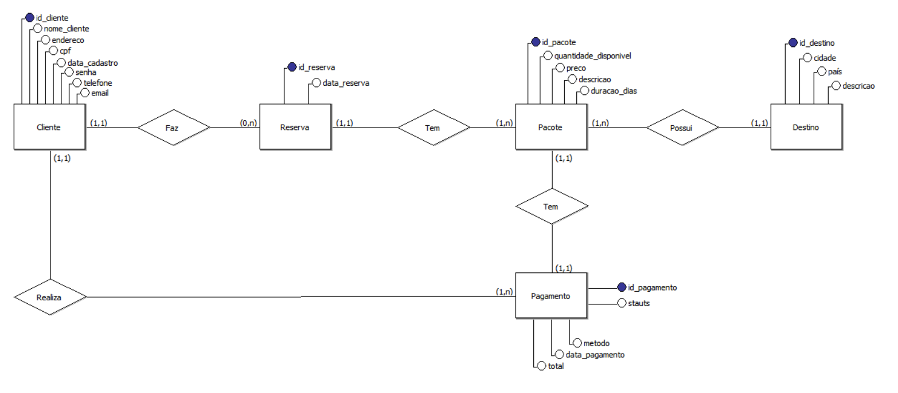
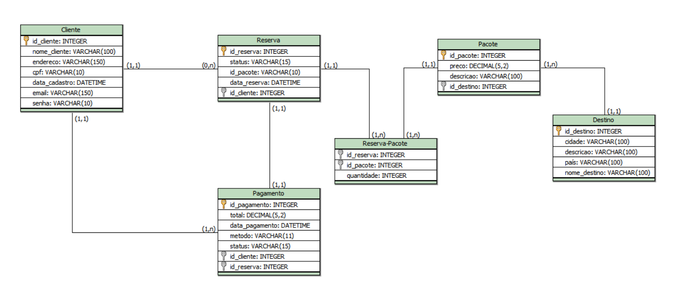

## Modelagem do Banco de Dados

Foi usado o brModelo para a execução da modelagem, seguindo os seguintes passos:

1. Identificação das Entidades;
2. Relacionamentos entre as Entidades;
3. Atributos que compõem cada Entidade;
4. Cardinalidade que os Relacionamentos têm.

### Modelo Conceitual

É através desse modelo que defimos as entidades e seus relacionamentos de forma abstrata.

### Modelo Lógico

Esse modelo implementa o modelo conceitual com detalhes técnicos, definindo tabelas, chaves primárias e estrangeiras.

